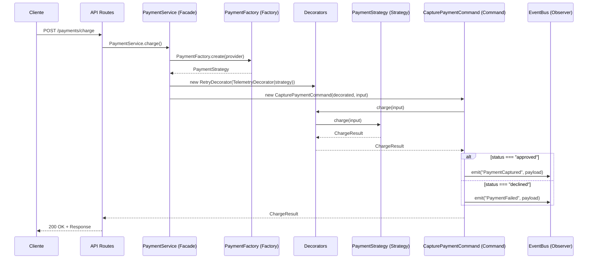

# 💳 Pasarela de Pagos Modular --- Node.js + TypeScript

## 📊 Estado del Proyecto


## 📘 Descripción General

Este proyecto implementa una API modular de pagos desarrollada en
Node.js y TypeScript, diseñada para demostrar la aplicación práctica de
12 patrones de diseño de software en un sistema realista.

La aplicación simula una pasarela de pagos que puede operar con
diferentes proveedores (Stripe, Mercado Pago), incluyendo manejo de
cobros, reembolsos y eventos.\
Desarrollado como proyecto académico para la materia Metodología de los
Sistemas II, aplicando principios de diseño, modularidad y
mantenibilidad.

## 🎯 Objetivos del Proyecto

-   ✅ Implementar 12 patrones de diseño en contexto real\
-   ✅ Favorecer la extensibilidad --- nuevos proveedores sin modificar
    lógica existente\
-   ✅ Desacoplar lógica de negocio de la capa de presentación (API)\
-   ✅ Testing exhaustivo con 54 tests y 90.22% de cobertura\
-   ✅ Simular comportamientos reales con mock SDKs

## 🏆 Patrones de Diseño Implementados (12)

  -------------------------------------------------------------------------------------
  Categoría        Patrón      Archivo Ejemplo            Propósito
  ---------------- ----------- -------------------------- -----------------------------
  Creacional       Singleton   logger.ts                  Logger centralizado única
                                                          instancia

                   Factory     PaymentFactory.ts          Creación estrategias por
                   Method                                 proveedor

  Estructural      Adapter     StripeAdapter.ts,          Unificar APIs de proveedores
                               MpAdapter.ts               externos

                   Decorator   RetryDecorator.ts,         Agregar reintentos y
                               TelemetryDecorator.ts      telemetría

                   Facade      PaymentService.ts          Simplificar interfaz del
                                                          subsistema

  Comportamiento   Command     CapturePaymentCommand.ts   Encapsular operaciones como
                                                          objetos

                   Observer    EventBus.ts                Sistema de eventos
                                                          desacoplado

                   Strategy    PaymentStrategy.ts         Algoritmos intercambiables
                                                          por proveedor

  Testing          Dummy       DummyPaymentProvider.ts    Objetos para completar
                                                          dependencias

                   Stub        StubPaymentProvider.ts     Respuestas predefinidas para
                                                          tests

                   Spy         SpyPaymentProvider.ts      Registrar interacciones en
                                                          tests

                   Fake        FakeEventBus.ts            Implementaciones
                                                          simplificadas
  -------------------------------------------------------------------------------------

## 🧪 Quality Assurance

### Resultados de Testing

    Test Files:  16 passed (16)
    Tests:       54 passed (54)
    Coverage:    90.22% Statements | 81.48% Branch | 97.56% Functions
    Duration:    4.57s

### Cobertura por Módulo

  Módulo       Statements   Branch   Functions   Lines
  ------------ ------------ -------- ----------- --------
  API Routes   88.7%        35.71%   100%        88.7%
  Commands     100%         88.88%   100%        100%
  Adapters     100%         60%      100%        100%
  Strategies   93.93%       100%     90.9%       93.93%
  Decorators   100%         100%     100%        100%

## 🏗️ Estructura del Proyecto

    payment-system/
    ├── src/
    │   ├── api/
    │   │   └── routes.ts                 # Endpoints Express
    │   ├── core/
    │   │   ├── commands/                 # Patrón Command
    │   │   │   ├── Command.ts
    │   │   │   ├── CommandBus.ts
    │   │   │   ├── CapturePaymentCommand.ts
    │   │   │   └── RefundPaymentCommand.ts
    │   │   ├── events/                   # Patrón Observer
    │   │   │   └── EventBus.ts
    │   │   └── payments/
    │   │       ├── adapters/             # Patrón Adapter
    │   │       │   ├── PaymentProvider.ts
    │   │       │   ├── StripeAdapter.ts
    │   │       │   └── MpAdapter.ts
    │   │       ├── decorators/           # Patrón Decorator
    │   │       │   ├── RetryDecorator.ts
    │   │       │   └── TelemetryDecorator.ts
    │   │       ├── facade/               # Patrón Facade
    │   │       │   ├── PaymentFacade.ts
    │   │       │   └── PaymentService.ts
    │   │       ├── factories/            # Patrón Factory
    │   │       │   └── PaymentFactory.ts
    │   │       ├── strategies/           # Patrón Strategy
    │   │       │   ├── PaymentStrategy.ts
    │   │       │   ├── PaymentContext.ts
    │   │       │   ├── StripeStrategy.ts
    │   │       │   └── MpStrategy.ts
    │   │       └── PaymentTypes.ts       # Tipos TypeScript
    │   ├── infra/
    │   │   └── logger.ts                 # Patrón Singleton
    │   ├── middleware/
    │   │   └── validate-request.ts       # Validación Zod
    │   ├── mocks/                        # SDKs Mock para testing
    │   │   ├── paymentSdks.ts
    │   │   ├── StripeMock.ts
    │   │   └── MercadoPagoMock.ts
    │   ├── schemas/                      # Esquemas validación
    │   │   ├── payment.schema.ts
    │   │   └── refund.schema.ts
    │   ├── tests/                        # Suite de testing
    │   │   ├── doubles/                  # Test Doubles
    │   │   │   ├── DummyPaymentProvider.ts
    │   │   │   ├── StubPaymentProvider.ts
    │   │   │   ├── SpyPaymentProvider.ts
    │   │   │   ├── FakeEventBus.ts
    │   │   │   └── doubles-demo.spec.ts
    │   │   ├── api.spec.ts
    │   │   ├── commands-observer.spec.ts
    │   │   ├── decorators.spec.ts
    │   │   └── [más tests...]
    │   └── app.ts                        # Aplicación principal
    ├── package.json
    ├── tsconfig.json
    ├── vitest.config.mts
    ├── sonar-project.properties
    └── README.md

## ⚡ Quick Start

### 1. Instalación

``` bash
git clone <repository>
cd payment-system
npm install
```

### 2. Desarrollo

``` bash
npm run dev
```

### 3. Testing

``` bash
npm test
npm run test:coverage
npm run lint
```

### 4. Producción

``` bash
npm run build
npm start
```

## 🌐 API Endpoints

### POST /payments/

Realiza un cargo mediante el proveedor especificado.

**Body:**

``` json
{
  "provider": "stripe",
  "amount": 2500,
  "currency": "ARS",
  "token": "tok_test_123",
  "metadata": {"order_id": "12345"}
}
```

**Respuesta:**

``` json
{
  "id": "ch_123",
  "status": "approved",
  "raw": {}
}
```
## 🔍 Flujo de Ejecución — Cargo de Pago



### POST /payments/refund

Realiza un reembolso de un pago existente.

**Body:**

``` json
{
  "provider": "mp",
  "paymentId": "mp_abc123",
  "amount": 1000
}
```

**Respuesta:**

``` json
{
  "id": "re_456",
  "status": "refunded",
  "raw": {}
}
```

## 🧠 Beneficios Arquitectónicos

### Extensibilidad

``` ts
class NewProviderAdapter implements PaymentProvider {
  async pay(input) {}
  async refund(input) {}
}

class NewProviderStrategy implements PaymentStrategy {}
```

### Testabilidad

``` ts
const spyProvider = new SpyPaymentProvider();
const fakeEventBus = new FakeEventBus();
await command.execute();
expect(spyProvider.payCallCount).toBe(1);
```

### Mantenibilidad

-   Separación clara de responsabilidades
-   Código desacoplado
-   Tipado fuerte TypeScript

### Escalabilidad

-   Decorators
-   EventBus
-   CommandBus

## 🛠️ Tecnologías y Herramientas

  Categoría      Tecnología
  -------------- ---------------------
  Runtime        Node.js, TypeScript
  Framework      Express.js
  Testing        Vitest, Supertest
  Validation     Zod
  Logging        Pino
  Code Quality   ESLint, SonarCloud
  Build Tool     TSX

## 👥 Integrantes del Equipo

-   Colleto, Dario
-   Kessler, Juan Pedro
-   Benamo Ortega, Joaquín

## 📚 Recursos Académicos

-   Patrones GoF
-   SOLID
-   Clean Code
-   TDD
-   Arquitectura Hexagonal
